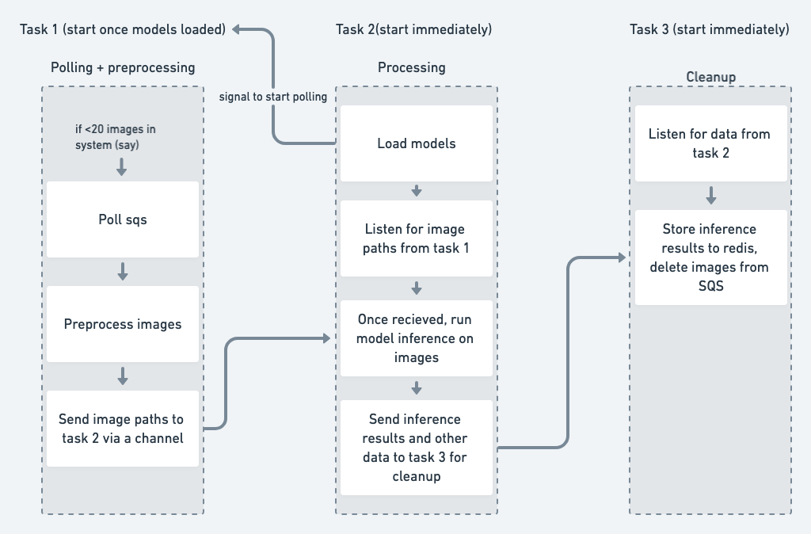
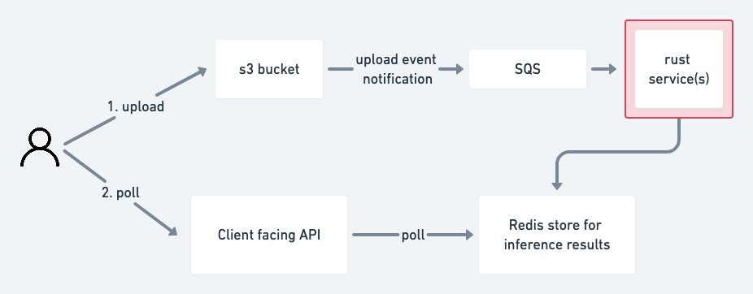
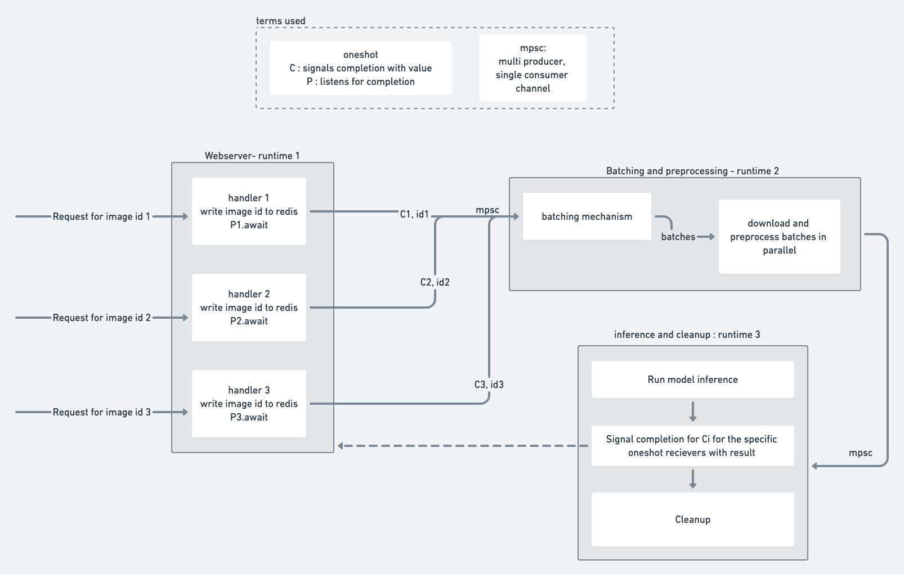
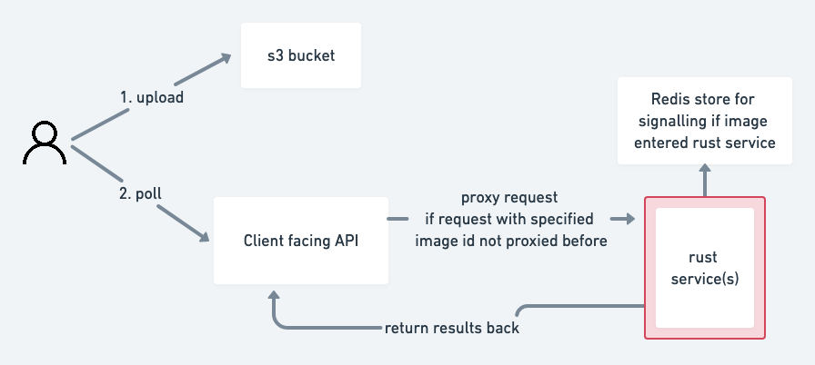

# Introduction to the product FoodDX

## Product intro

[FoodDX](https://www.fooddx.com/) is a service which helps people get insights on how to improve their diet with the help from our proprietary AI technology and personalized feedback from our nutrition experts. In it's current stage, it helps score images of food taken through an app, and gives it a score from 1-5, and also provides personalized tips for the food.

It's a big project with a lot of components - the AI models, the app, and the backend infrastructure which handles it all. We'll be taking a look at the backend in this article.

## Lifecycle of an image

Before we dive into the infrastructure, it would help to take a look at what an image goes through once it enters our system.

- The image is assigned a UUID.
- The image is uploaded to a `s3` bucket.
- The image is then downloaded, preprocessed, run through our models, and a food tip is generated for the image.
- The food tip, inference results and the image hash [^1] form the final response.

## Stack decisions: Rust and haskell

Haskell is used for the client facing API, and it's for other ad-hoc tasks such as reading/writing to a database among others.

Rust is used for image preprocessing, model inference and sending the results back. Sending of results was done differently in the two approaches outlined below. Rust was chosen for it's high efficiency, small executable footprint, and absence of a garbage collector. It also had strong type system, speed & relatively actively maintained Tensorflow (client) library.

# Introduction and pitfalls of the existing architecture

The internal organization of the rust service in this architecture is outlined above.
There were 3 main parts, all running concurrently on 3 separate tokio[^2] runtimes - namely polling sqs, preprocessing and running inference on the images, and cleanup tasks (like writing results to redis, notifying SQS that the image can now be taken off the queue, etc).

The external processes related to this architecture are outlined below.

The main gripe we had was in the `S3` to `SQS`[^3] upload event notification. In our benchmarks, it was [very slow](https://github.com/Holmusk/aws_benchmarks/tree/master/s3_event_to_sqs), and we aim for the service to have a very low latency, with the goal being that every image that comes into the system should be scored/rated in **under 1 second** . Because of the way the system was designed, this meant that we'd need a pretty big makeover on the rust side, and some tweaks on the haskell side if we were to get closer to meeting our performance goals. This is also mentioned in the [AWS docs](https://docs.aws.amazon.com/AmazonS3/latest/userguide/NotificationHowTo.html), where they state that `Typically, event notifications are delivered in seconds but can sometimes take a minute or longer`.

# The new architecture

As mentioned above, the main reason for redesigning the architecture was to avoid the `S3` to `SQS` upload event notification as low latency is of high priority in this project. In the process, we found out that we actually simplified it, by removing unnecessary moving parts.

Internally, the Rust service now also has a [webserver](https://developer.mozilla.org/en-US/docs/Learn/Common_questions/What_is_a_web_server). The client facing API (written in Haskell) proxies the HTTP requests it receives to the Rust server via a load balancer (AWS ELB). In this version of the architecture, we completely eliminate the use of a queue (`SQS`).

## Rust webserver internals

We have chosen to use [`warp`](https://github.com/seanmonstar/warp)[^4] for the web server implementation in Rust.

We have 3 tokio runtimes running simultaneous and somewhat independently of one another. These tokio runtimes communicate with each other using messages that are passed between them using bounded [channels](https://doc.rust-lang.org/book/ch16-02-message-passing.html). The "messages" we pass are custom [`Structs`](https://doc.rust-lang.org/book/ch05-01-defining-structs.html) we define for communication.

Finally, because each request handler needs a result for it's own image, the handler initially creates a [oneshot](https://tokio-rs.github.io/tokio/doc/tokio/sync/oneshot/index.html) for receiving it's results and this is passed along as metadata for the image. Once the image is inferred to in a batch, the data is sent back to the image's corresponding request handler so the results can be returned.

As mentioned, we have completely avoided the use of SQS in this architecture. The external architecture around the rust service now looks like this:

### Types of channels used

### Monitoring health

#### to panic or not to panic

#### webserver errors

#### Tracking metrics

# Future possibilities

## Tighter integration via Rust's FFI

---

[^1]: The image hash is calculated and used to check for duplicates.
[^2]: Rust allows you to choose whichever one. Tokio is the most popular option in the Rust ecosystem. Check out [this resource](https://rust-lang.github.io/async-book/08_ecosystem/00_chapter.html) for more insight into async and the rust async ecosystem!
[^3]: Amazon [`SQS`](https://aws.amazon.com/sqs/) is a fully managed queue which we were using to distribute messages to different Rust service instances.
[^4]: We used [`warp`](https://github.com/seanmonstar/warp) because of it's excellent tokio interoperability and flexible [`Filter`](https://docs.rs/warp/0.1.0/warp/trait.Filter.html) system.
